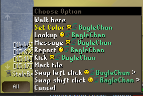
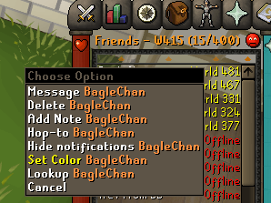

# Chat Name Colors

Differentiate players in your chat with custom colors!

# Recolor a User
Simply hold down "Shift" and righ click a user name in chat or in your Friends list!

# Settings

Color Your Name - Enables the ability to recolor your name in Chat

Your Name Color - Specify the color your would like to recolor your name to in Chat (If "Color Your Name" is enabled)

Unspecified Users - When enabled, all User's will be given unique names. When disabled, only Users that you have explicitly set Colors for will be recolored.