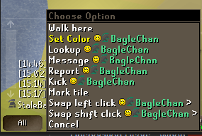
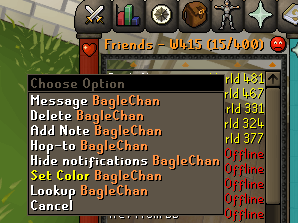

# Chat Name Colors

Easily distinguish players in chat by assigning them custom colors.

---

## Recolor a User

To change a user’s color, hold **Shift** and **right-click** their username. This works in both the chat box and your Friends List.

  

---

## Color Types

There are two ways colors are handled:

- **Manual:** Explicitly set by you and saved permanently.
- **Unspecified:** Automatically assigned by the plugin. Only the 500 most recently seen users retain their colors between sessions.

### Modifying Colors

When you shift right-click a username, you’ll see several options:

- **Pick:** Immediately sets a **Manual** color.
- **Random:** Assigns a new color. If *Unspecified Users* is disabled, this becomes a **Manual** color.
- **Save:** Upgrades an **Unspecified** color to **Manual**, keeping it permanently.
- **Reset:** Removes a **Manual** color or reverts it to a random **Unspecified** color.

---

## Settings

- **Unspecified Users:**  
  When enabled, all users get automatic colors. When disabled, only manually colored users are recolored.

- **Color Your Name:** Enable to set a custom color for your own username.

- **Your Name Color:** Choose your personal color (requires *Color Your Name* enabled).

- **Color Entire Message:** Colors the entire chat message, not just the username.

- **Recolor Friends List:** Applies your saved colors to names in the Friends List.

---

> **Note:** Resetting the plugin configuration will permanently delete all saved colors, including Manual ones.